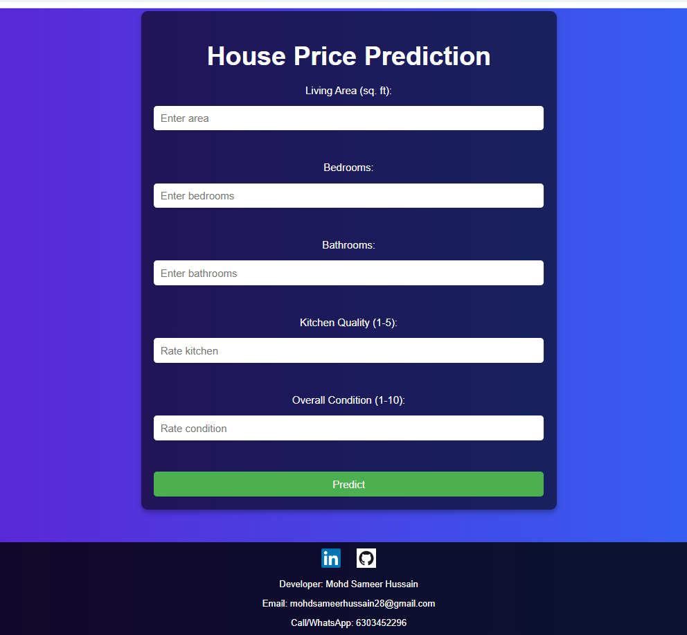
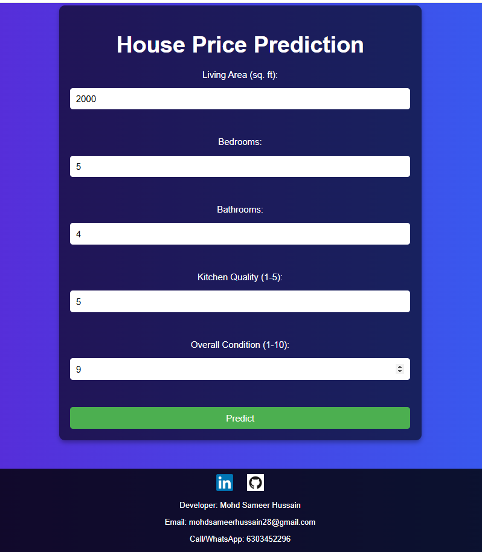
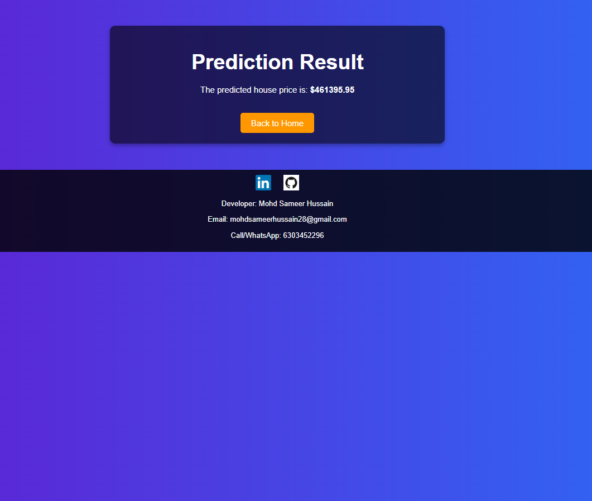
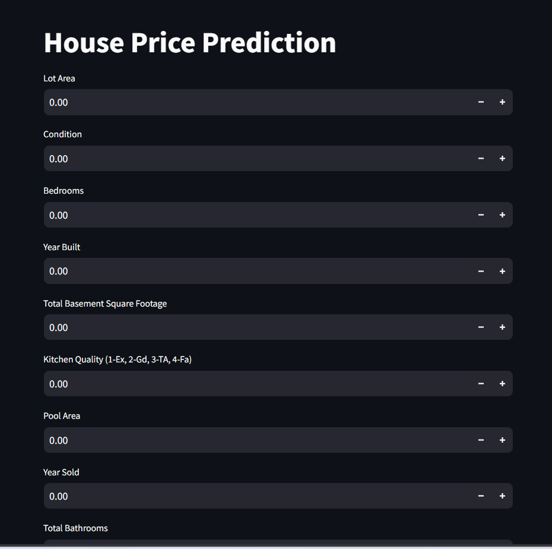

# House-price-prediction-WebApp
This project aims to build a machine learning model that predicts house prices based on various features such as lot area, street type, number of bedrooms, and more. For more details read readme.md

## 🚀 Goal
The primary goal of this project is to develop a web application that predicts house prices based on user inputs using a pre-trained machine learning model.

## 🎯 Objectives
Create an interactive and user-friendly web interface for house price prediction.
Integrate a trained machine learning model (Random Forest Regressor) for real-time predictions.
Provide a clean and visually appealing design, along with links to my professional profiles (LinkedIn and GitHub).

## 📝 Description
This project is a web-based house price prediction application where users can input features such as the living area, number of bedrooms, bathrooms, kitchen quality, and overall condition of the house. The app predicts the price of the house based on a machine learning model trained on historical housing data

## 📸 **Screenshots**
### Home Page

### Input Form

### Prediction Result

### Streamlit Result

## Key Features:
* User-friendly form to collect house details.
* Real-time prediction of house prices using a Random Forest model.
* Aesthetic design with a gradient background and intuitive layout.
* Links to my LinkedIn and GitHub profiles for professional networking.

## 🌟 Results
The web application successfully predicts house prices based on user-provided inputs. The predictions are displayed in a clean and professional output format, ensuring usability for potential users.

## 💡 Why This Project?
I chose this project because the real estate industry is a dynamic and data-driven field. Predicting house prices accurately can help both buyers and sellers make better decisions. By using machine learning to predict house prices based on multiple features, I gained valuable experience in data preprocessing, model development, and web app deployment. Additionally, deploying the project as a web app provided me with hands-on experience in building interactive applications with Flask.

## 🛠️ Technologies Used
* Backend: Flask, Python
* Frontend: HTML, CSS
* Machine Learning Model: Random Forest Regressor (Trained using scikit-learn)
* Database: SQLite for future enhancements
* IDE: Visual Studio Code

## Developer Information
* Developer Name: Gaikwad Om Bhausaheb
* Email: gaikwadom2626@gmail.com
* Phone/WhatsApp: (+91)7498222626
* LinkedIn: http://www.linkedin.com/in/om-gaikwad-91955131b

